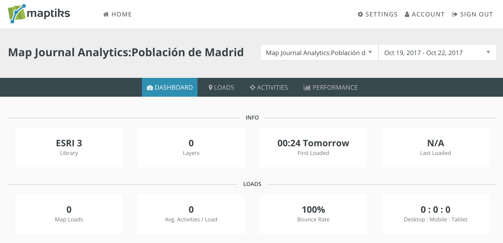
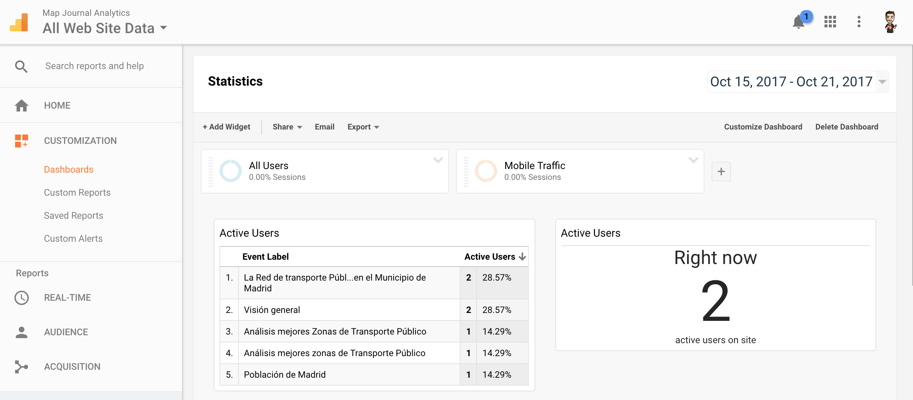

Story Map Journal Analytics
=================

This is a fork of [sparkgeo/storymap-journal](https://github.com/sparkgeo/storymap-journal)
were I have added also Google Analytics to the equation, this way you have
several ways to track your traffic.

Commands:

* Developer mode: `grunt server`
    * Open:  `http://localhost:8080/src/?appid=d2134b4665df4fdea6077a9255315484`
* Deploy new version: `grunt`

**Latest release is version 1.13.1**; if you want to be informed of new releases, we recommend you to watch this repository ([see GitHub help](https://help.github.com/articles/watching-repositories)). See the [release page](https://github.com/Esri/map-journal-storytelling-template-js/releases) for release notes.

## But also using Google Analytics

